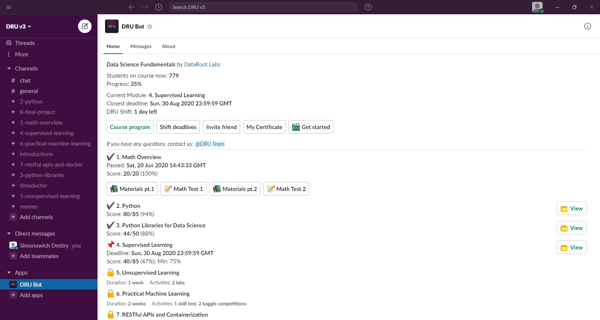

# Welcome to the first DRU course tutorial

#### Here we’ll summarize these topics:
- What Slack is and how to use it?
- How to start your course?
- How to pass the First Module?
- How to use given materials?

---
### What Slack is and how to use it?
The link in invitation leads you to the platform called **Slack**.
**Slack** is the corporate messenger where you’ll take the course. It's features are similar to the most usual messengers you used before, so you’ll quickly get used to.

**Slack web overview:**

We highly recommend to download the desktop version of **Slack** because of its much more user-friendly interface than it's web-version.

#### Links for download:

**Windows**: https://slack.com/intl/en-ua/help/articles/209038037-Download-Slack-for-Windows   
**Mac**: https://slack.com/intl/en-ua/help/articles/207677868-Download-Slack-for-Mac   
**Linux**: https://slack.com/intl/en-ua/help/articles/212924728-Download-Slack-for-Linux--beta-

After downloading you have to input the **workspace name**. 
Here is it: **dru-v3.slack.com**

**Warning: Use only the mail that received the invitation, otherwise your account won't be invited to the course**
If you have any questions contact us: **@DRU Team**

**Slack Desktop overview:**

Leftwards you could find the main channels for live communication, discussion of problems and converse with other students:

- **#chat** — the main chat for communication and discussion of the course
- **#introductions** — a place where you can tell about yourself and find people to study together
- **#general** — a channel with messages from the bot about new students of the course and greetings to those who have already completed it. <u>Also fresh vacancies are posted here<u>
- **#n_module_name** (where n = 1, ..., 8) — chats are created for questions related to the specific module

Most of the studying will take place in **@DRU Bot App**. You could find it at the bottom of the chat list. 

---
### How to start the course?
At the moment you got into Slack, you automatically applied to the “Data Science Fundamentals” course.
To check your task and modules go to the **@DRU Bot** App

**If you don't have DRU Bot App there and couldn't find it via the search, contact us: @DRU Team**

Here you'll see simple Bot's interface and some course info:
- How many students on the course now
- Your total progress 
- Your Current Module
- Closest deadline
- And how many days to shift you have now

Also there are 2 buttons, that you’ll use all the time on course:
- "Course program"
- "Shift deadline"
- "Invite friend"   
- "My Certificate"
- "My CV"
- "Get started"

 ---
#### "Shift deadline" Button
This course is intensive and all modules have deadlines. And If you have not enough time to do your module, but want to continue studying you could shift the deadline a little.
Initially you’ll be given only 10 "shift days". So **use it wisely** 

**How to shift the deadline:**
1. Click “Shift deadlines”
2. Choose the number of days you wanna shift
3. Then “Submit”

**Demo:**

---
#### “Invite friend” Button
To make learning easier and more interesting you could invite your friend(s) to the course using unique referral code. For inviting this way you and your friend(s) will be rewarded some more shift days.  

**How to invite friend:**
1. Click “Invite friend”
2. Copy your referral code and link for the course page and send them to your friend
3. When registering, they have to paste your code into the special box below

**Demo:**
    

**Warning: link itself is not referral. Your friend(s) will be referred only pasting your code into corresponding box** 

---
#### “My Certificate” Button
Here will be posted the link to your certificate, once you completed the course
Before this you should put your real name and surname, that will appear in your certificate, there 

---
#### “Get started” Button
This one will leads you to a short video guide about usage of Bot's interface
[Here is this video](https://www.youtube.com/watch?v=akHvJQDv4GM&ab_channel=DataRootLabs)

---
### How to pass the First Module?
From the moment of applying you’ll be given 2 Materials Tables and 2 Math Tests:

Also you could see your deadlines here. 
By default, time for passing Module 1 is 14 days from the moment of applying. 

#### There are some things you should remember about course in whole:
- There're no time limits for passing specific test, lab or project. There is only deadline for module at whole 
- To unlock the next module you have to score **75%** of the current module maximum possible points;
- If you unlocked the next module before the deadline — the remaining days will be added to the next module;
- You could use "shift days" even after you accidently failed the deadline 
- If you failed the deadline or spent all submission attempts but not opened the next module — contact us: **@DRU Team**

**Demo:**

**Most students don’t pass the test on the first try, but it’s OK,** you have 10 attempts and many useful materials, which we will talk about now

---
### How to use given Materials?
**Materials** — an activity that isn’t evaluated and depends entirely on you. 
**You don’t need to study everything** — choose only those sections with which you have difficulties or which you want to improve.

There are two main types of materials: **Main** and **Additional**
- **Main Materials** — include basic concepts and topics, the understanding of which is necessary.
- **Additional Materials** — include interesting articles on some topics, books and alternative video courses.

All resources are divided into math sections and activity types (MOOCs, articles, books, videos). There is approximate time required to complete the activity at a normal speed to help you to plan your studying effectively.

***Hint:** you can open the Math Test (don't submit yet) and see which tasks you are not familiar with and what topics you need to study/recap. Note, that you haven't any time limits for passing the test, only limits on attempts.
___
**Good luck!**
If you have any questions, ideas or comments, feel free to contact us! 
**@DRU Team** will be glad to help you with any requests :)
